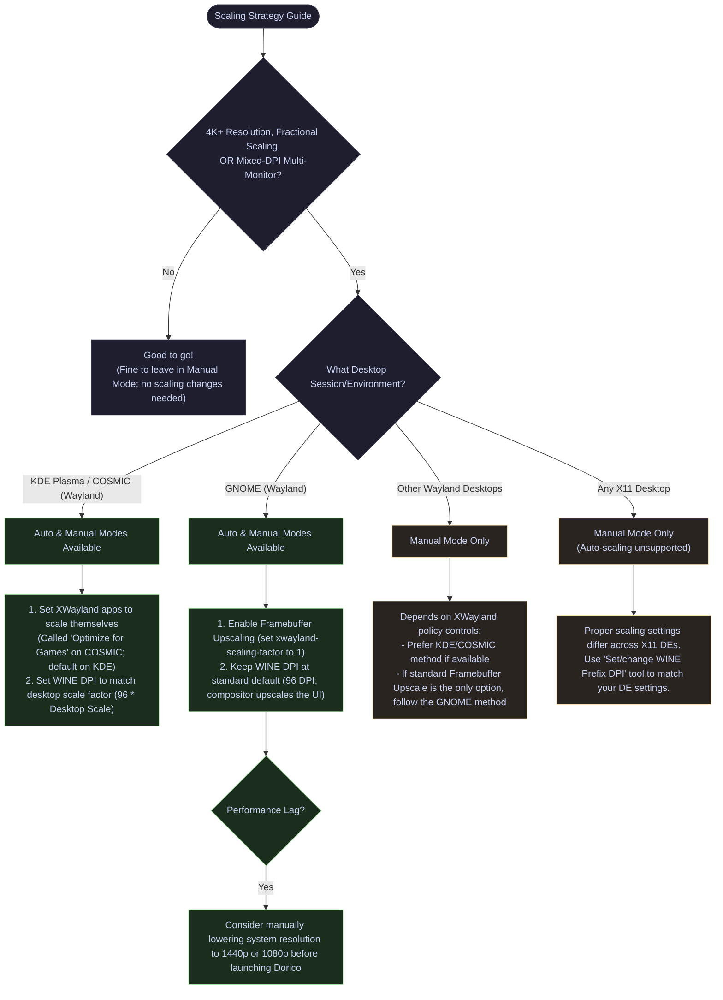

# Display Scaling & Graphics Strategy

Because Steinberg Dorico runs via WINE (which operates on legacy X11 protocols via XWayland), high-resolution monitors and modern desktop fractional scaling setups on Wayland require a little bit of extra attention to get looking their best.

This document details the graphics architecture, automatic and manual scaling strategies, and troubleshooting recommendations for running Dorico on Linux.

---

## The Scaling Decision Flowchart

Use the following flowchart to determine how to scale Dorico on your environment:

---

## Under the Hood: Mathematical Formulas

Depending on how your Desktop Environment scales legacy X11/XWayland applications, Torquio's **Auto Graphics Mode** calculates the target WINE DPI using a standard **`96 DPI`** logical baseline (desktop scale factor $\times$ 96):

### 1. GNOME (Mutter-based Framebuffer Upscaling)
By default, scaled GNOME desktops on Wayland render legacy X11 applications by downscaling an oversized X11 canvas. They look great, but we consider the performance penalty to be unacceptably high. Unfortunately, on GNOME there is no way to disable compositor scaling entirely (if there was, you could simply set the WINE DPI to correspond to you desktop scaling factor and you'd be good to go; this is what we do on KDE/COSMIC). Subsequently, the only other available option is to disable its default oversized downscale (which GNOME confusingly calls XWayland native scaling) and let the compositor perform the entire scaling itself. This looks worse, but is far more performant, and is therefore our recommendation (and the default behavior in Auto Mode). Under this configuration, the WINE DPI remains at its baseline:

$$\text{Target WINE DPI} = 96\text{ DPI}$$

*Example:* At 150% scaling, WINE renders at standard 96 DPI, and the GNOME compositor upscales the final window output to 1.5x.

### 2. KDE Plasma / COSMIC (Native Application Scaling)
These compositors allow XWayland applications to scale themselves natively. The compositor bypasses upscaling, allowing WINE to render at a 1:1 pixel ratio while handling UI scaling internally:

$$\text{Target WINE DPI} = 96 \times \text{Desktop Scale Factor}$$

*Example:* At 150% scaling, WINE renders at a native $96 \times 1.50 = 144\text{ DPI}$.

### 3. (optional) Match Hardware Physical DPI
Additionally, enabling **Match Hardware Physical DPI** in the graphics configuration menu anchors the scaling calculation directly to your monitor's exact hardware physical subpixel density (queried from EDID data via desktop APIs, e.g., `161 DPI`) instead of the standard `96 DPI` baseline. This might not be tremendously useful to most people, but it could be an option if you prefer UI elements sized relative to the screen's real physical dimensions (which will usually be different from your DE's scaling factor). This largely exists in Torquio by virtue of the fact that it was our first approach to an automatic scaling solution; however when we pivoted to our current approach, we simply left this in for anyone who might want to really dial things in.

---

## Manual Configuration for Unsupported Desktops

If your environment is not automatically supported by Torquio's Auto Graphics Mode, scaling must be managed manually.

### Other Wayland Desktops (e.g., Sway, Hyprland, Wayfire)
1. Check if your compositor exposes XWayland scaling policies.
2. **If native scaling is supported**: Allow XWayland clients to scale themselves, and set the WINE DPI manually via Torquio (`torquio -g`) to match your desktop's scale factor (e.g., `144 DPI` for 150%).
3. **If framebuffer upscaling is the only option**: Force the compositor to upscale (e.g., scale factor = 1) and leave WINE DPI at the baseline `96 DPI`.

### X11 Desktop Environments (e.g., Linux Mint / Cinnamon, XFCE, MATE)
Because each X11 environment handles fractional scaling differently, you must manually adjust your Wine Prefix DPI using Option 2 ("Set/change WINE Prefix DPI") in the graphics settings. 

As a reference, on **Linux Mint (Cinnamon)**:
*   **Integer Scaling (e.g., 200%)**: Set Wine DPI to `Scale × 96` (e.g., **192 DPI**).
*   **Fractional Scaling ("Scale Down" enabled)**: Set Wine DPI to **192 DPI** (Cinnamon renders at 200% and scales down).
*   **Fractional Scaling ("Scale Up" enabled)**: Set Wine DPI to the default **96 DPI** (Cinnamon renders at 100% and scales up).

---

## Warnings & Performance Recommendations

> [!CAUTION]
> **Global XWayland Setting Changes**
> Auto Graphics Mode operates on global desktop environment settings (specifically your compositor's XWayland scaling policies). If you actively run other legacy X11/XWayland applications (outside of games or modern native Wayland apps), these changes could affect their appearance. If this is undesirable, switch to **Manual Graphics Mode** in the Torquio menu.

> [!TIP]
> **Performance at 4K+ Resolutions**
> Even on decent hardware, we still don't always see ideal performance when running Dorico in 4K (and above). In those cases, consider manually lowering your host desktop resolution to 1440p or 1080p before launching Dorico.
